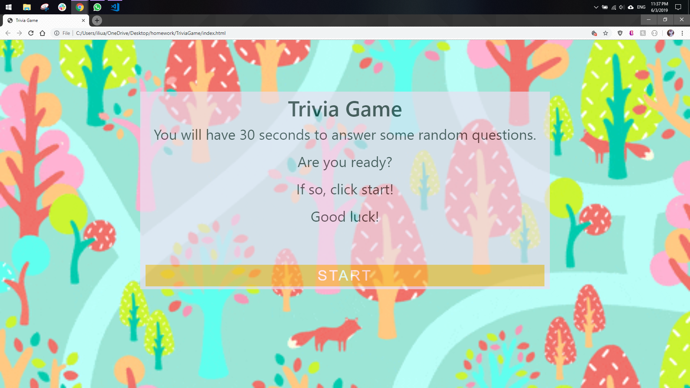

# TriviaGame

## About
This is a trivia game page that shows one question and four potential answers at a time, with a timer. The player will choose an answer that will lead them to a results page. If the timer runs out, the player will be lead to a different results message. At the end of the game, the number of correct answers chosen will be shown to the player and they will be able to restart the trivia without having to refresh the page. 

## Technology Used 
* HTML
* CSS
* Bootstrap
* Javascript
* jQuery

## Author
Adrienne Liu